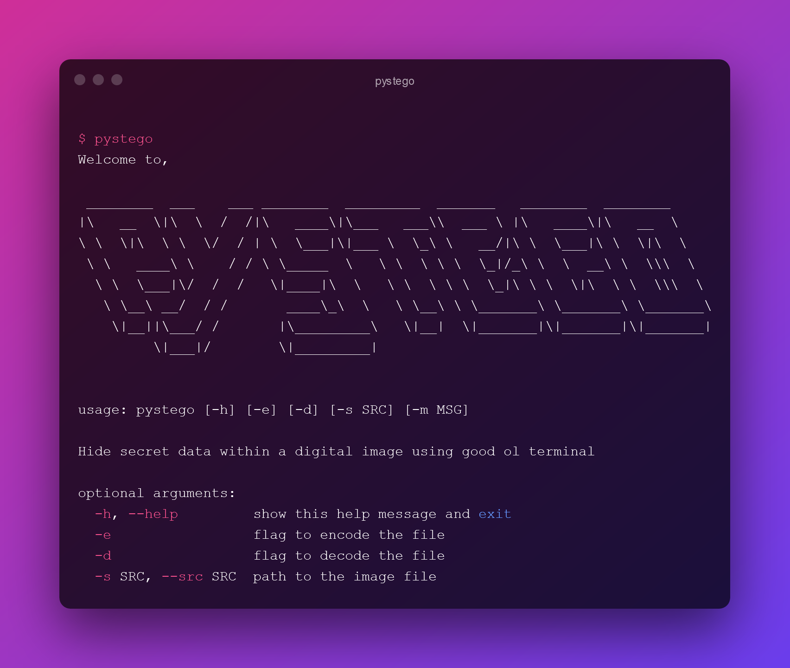

# pystego
Hide secret data within a digital image using good ol' terminal



## Installation
The recommended way for installing this package is using, python PIP, package installer for python and git, the stupid content tracker. Linux users can install them using `sudo apt install python3-pip git`. After installing pip run this command,
```
pip install git+https://github.com/GuptaAyush19/pystego.git
```
Users can also install this manually using
```
# if ssh setup
git clone git@github.com:GuptaAyush19/pystego.git
# else using https
# git clone https://github.com/GuptaAyush19/pystego.git

pip install .
```

## Usage
Upon installation and packages all setup, the package can now
directly execute using the command given below. Note that this is os independent which means it can run on both linux and windows.
```
# encode using message as an argument (not recommended as this will be saved in your terminal history)
pystego -e -s <PATH_TO_FILE> -m 'hello there'
# decode
pystego -d s <PATH_TO_FILE>
```

Flags and arguments:
1. `-e` => flag to encode the file
2. `-d` => flag to decode the file
3. `-s` => path to the image file, also referred to as source/src

## Example

The following shows an example of encoding and decoding a message using `-e`, `-d` and `-s` flag only. Enter the message once the prompt `ENTER MESSAGE:` is visible. 
### Encoding
```
$ pystego -es resources/hacker.png
INFO:root:ENCODING `resources/hacker.png`
ENTER MESSAGE: this is something else
DEBUG:PIL.PngImagePlugin:STREAM b'IHDR' 16 13
DEBUG:PIL.PngImagePlugin:STREAM b'IDAT' 41 65536
SUCCESS: Image Encoded Successfully @ resources/hacker.png
```
### Decoding
```
$ pystego -ds resources/hacker.png
INFO:root:DECODING `resources/hacker.png`
DEBUG:PIL.PngImagePlugin:STREAM b'IHDR' 16 13
DEBUG:PIL.PngImagePlugin:STREAM b'IDAT' 41 65536
SUCCESS: Image Decoded Successfully @ resources/hacker.png
→ this is something else
```

## TODO
- Implement file encoding into digital images
- Save the output message into another standalone file
- Implement encryption of the original text for better security

## License
This repository falls under [GPL-3.0 License](https://github.com/GuptaAyush19/pystego/blob/master/LICENSE)